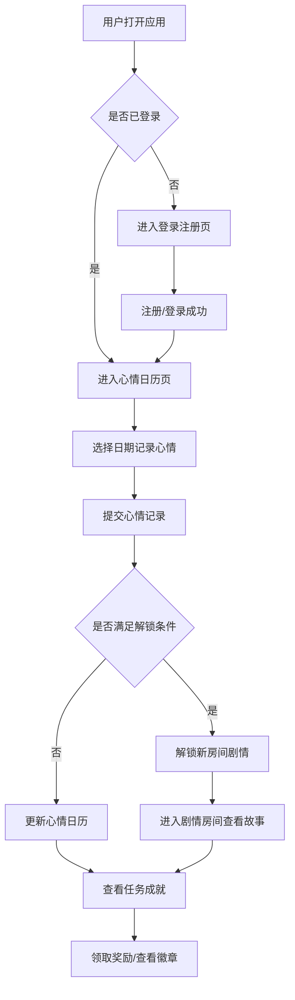

## 1. 产品概述

"梦境旅馆"是一款幻想题材的情感陪伴 Web 应用，用户通过记录每日心情来解锁神秘的梦境房间故事。应用以温暖治愈的奇幻风格，为用户提供情感宣泄与陪伴体验。

- 核心价值：通过心情记录与剧情解锁机制，帮助用户梳理情绪，获得心灵慰藉
- 目标用户：需要情感陪伴、喜欢幻想故事、有日常记录习惯的年轻用户群体

## 2. 核心功能

### 2.1 用户角色

| 角色 | 注册方式 | 核心权限 |
|------|----------|----------|
| 住客（普通用户） | 用户名/邮箱注册登录 | 记录心情、解锁房间、查看剧情、完成任务、获取成就 |

### 2.2 功能模块

1. **登录注册页**：用户注册、登录、找回密码
2. **心情日历页**：日历视图、每日心情记录、心情统计
3. **剧情房间页**：房间列表、房间详情、故事剧情、解锁机制
4. **任务成就页**：每日任务、成就徽章、进度展示
5. **个人中心页**：用户信息、设置、数据统计

### 2.3 页面详情

| 页面名称 | 模块名称 | 功能描述 |
|----------|----------|----------|
| 登录注册页 | 表单模块 | 用户注册（用户名+密码+邮箱）、用户登录、表单验证、错误提示 |
| 登录注册页 | 视觉模块 | 幻想风格背景、动态光影效果、梦境旅馆 Logo 展示 |
| 心情日历页 | 日历模块 | 月历视图展示、已记录日期标记、心情颜色编码 |
| 心情日历页 | 心情记录模块 | 心情选择（开心/平静/忧伤/焦虑/愤怒）、心情日记文本、可选标签、提交保存 |
| 心情日历页 | 统计模块 | 本月心情分布、连续记录天数、心情趋势图 |
| 剧情房间页 | 房间列表模块 | 房间卡片展示、解锁状态标识、房间预览图 |
| 剧情房间页 | 房间详情模块 | 房间场景展示、故事文本、章节进度、对话交互 |
| 剧情房间页 | 解锁模块 | 根据心情记录天数/心情类型解锁对应房间故事 |
| 任务成就页 | 任务模块 | 每日任务列表、任务完成状态、奖励领取 |
| 任务成就页 | 成就模块 | 成就徽章墙、已解锁/未解锁成就、成就详情 |
| 个人中心页 | 用户模块 | 头像、昵称、入住天数、总记录数 |
| 个人中心页 | 设置模块 | 隐私设置、通知设置、退出登录 |

## 3. 核心流程

用户核心流程：登录 → 记录每日心情 → 积累解锁条件 → 解锁剧情房间 → 阅读故事 → 完成任务获得成就 → 持续记录形成正向循环。

## 4. 用户界面设计

### 4.1 设计风格

- **主色调**：深紫色 `#3D2C5C`（梦境神秘）、柔粉色 `#E8B4D9`（温暖治愈）、月光蓝 `#7BA3C9`（宁静梦幻）
- **辅助色**：金色 `#D4AF37`（星光点缀）、银色 `#C0C0C0`（月光）
- **背景色**：渐变夜空 `#1a1a2e` → `#16213e` → `#0f3460`
- **按钮风格**：圆角（16px）、渐变填充、微发光效果、悬浮放大动画
- **字体**：标题使用「思源宋体」（典雅梦幻），正文使用「思源黑体」（清晰易读）
- **布局风格**：卡片式设计、毛玻璃效果（backdrop-filter）、层次叠加
- **图标风格**：线性图标配合微光动效、使用幻想元素（星星、月亮、云朵、钥匙、门）

### 4.2 页面设计概述

| 页面名称 | 模块名称 | UI 元素 |
|----------|----------|----------|
| 登录注册页 | 整体设计 | 星空背景动画、漂浮的梦境元素、中央发光卡片表单、柔和的渐变按钮 |
| 心情日历页 | 日历区域 | 月历卡片、心情色点标记、今日高亮、翻页动效 |
| 心情日历页 | 记录弹窗 | 半透明毛玻璃弹窗、心情 emoji 选择器、文本输入框、提交按钮 |
| 剧情房间页 | 房间列表 | 网格布局的房间卡片、锁定/解锁状态视觉区分、房间名称与预览、悬停浮动效果 |
| 剧情房间页 | 故事阅读 | 章节进度条、沉浸式故事文本、打字机动效、章节切换动画 |
| 任务成就页 | 任务列表 | 待办/已完成状态、进度条、奖励图标、领取按钮 |
| 任务成就页 | 成就墙 | 徽章网格、已解锁徽章发光、未解锁徽章灰度、点击查看详情 |
| 个人中心页 | 用户信息 | 圆形头像、用户昵称、入住天数统计、设置入口 |

### 4.3 响应式设计

- **桌面优先**：1280px 以上为主要设计尺寸，采用左右分栏或居中卡片布局
- **平板适配**：768px-1279px，调整卡片尺寸与间距，保持网格布局
- **移动适配**：768px 以下，单列布局，底部导航栏，优化触控区域（最小 44px）
- **触摸优化**：按钮与可点击元素确保足够的触控面积，滚动体验流畅

### 4.4 动效与交互

- **页面入场**：元素渐入 + 轻微上浮动画，stagger 错开效果
- **心情记录**：选择心情时的缩放动效，提交成功的粒子飘散效果
- **房间解锁**：光芒放射 + 钥匙旋转动画，解锁成功的庆祝动效
- **故事阅读**：文字逐行淡入，章节切换的翻页效果
- **悬停效果**：按钮与卡片的轻微放大、阴影加深、发光边框
