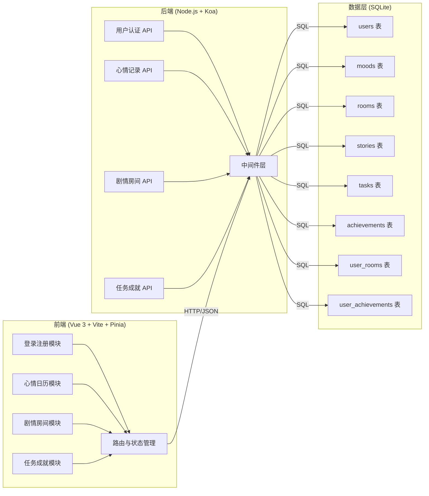
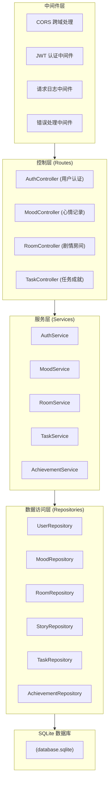
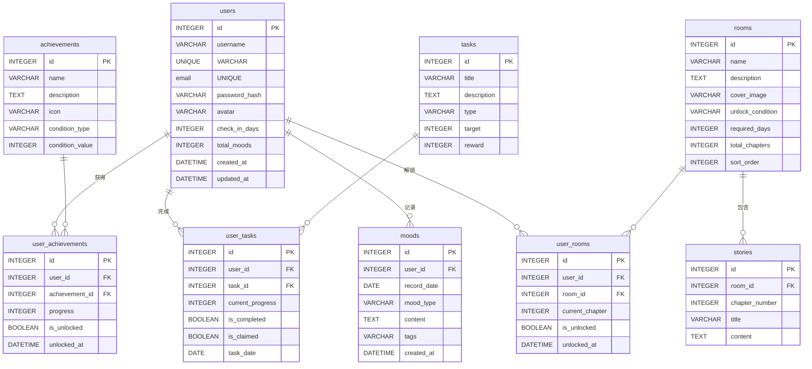

## 1. 架构设计



## 2. 技术描述

### 2.1 前端技术栈
- **框架**：Vue 3 (Composition API)
- **构建工具**：Vite 5.x
- **状态管理**：Pinia 2.x
- **路由**：Vue Router 4.x
- **HTTP 客户端**：Axios
- **样式方案**：SCSS + CSS Variables
- **UI 组件**：自定义组件（无第三方 UI 库）
- **图标**：Lucide Icons

### 2.2 后端技术栈
- **运行时**：Node.js 18+
- **Web 框架**：Koa 2.x
- **中间件**：
  - `koa-bodyparser`：请求体解析
  - `koa-router`：路由管理
  - `koa-cors`：跨域处理
  - `koa-jwt`：JWT 认证
- **数据库**：SQLite 3
- **ORM**：better-sqlite3
- **密码加密**：bcryptjs
- **Token**：jsonwebtoken

### 2.3 项目初始化
- 前端：`npm create vite@latest client -- --template vue`
- 后端：手动创建 Node.js 项目结构

## 3. 前端路由定义

| 路由路径 | 页面名称 | 权限要求 |
|----------|----------|----------|
| `/login` | 登录页 | 公开 |
| `/register` | 注册页 | 公开 |
| `/` | 心情日历页 | 需要登录 |
| `/calendar` | 心情日历页 | 需要登录 |
| `/rooms` | 剧情房间列表 | 需要登录 |
| `/rooms/:id` | 房间详情页 | 需要登录 |
| `/achievements` | 任务成就页 | 需要登录 |
| `/profile` | 个人中心页 | 需要登录 |

## 4. API 接口定义

### 4.1 通用响应格式
```typescript
interface ApiResponse<T> {
  code: number;
  message: string;
  data: T;
}
```

### 4.2 用户认证接口

#### 注册
```typescript
// POST /api/auth/register
interface RegisterRequest {
  username: string;
  email: string;
  password: string;
}

interface RegisterResponse {
  userId: number;
  username: string;
  token: string;
}
```

#### 登录
```typescript
// POST /api/auth/login
interface LoginRequest {
  username: string;
  password: string;
}

interface LoginResponse {
  userId: number;
  username: string;
  email: string;
  token: string;
}
```

#### 获取用户信息
```typescript
// GET /api/auth/profile
interface UserProfile {
  id: number;
  username: string;
  email: string;
  avatar: string;
  checkInDays: number;
  totalMoods: number;
  createdAt: string;
}
```

### 4.3 心情记录接口

#### 记录心情
```typescript
// POST /api/moods
interface CreateMoodRequest {
  date: string; // YYYY-MM-DD
  moodType: 'happy' | 'calm' | 'sad' | 'anxious' | 'angry';
  content?: string;
  tags?: string[];
}

interface MoodRecord {
  id: number;
  date: string;
  moodType: string;
  content: string;
  tags: string[];
  createdAt: string;
}
```

#### 获取某月心情记录
```typescript
// GET /api/moods?year=2024&month=6
interface MoodListResponse {
  records: MoodRecord[];
  stats: {
    moodDistribution: Record<string, number>;
    streakDays: number;
    totalThisMonth: number;
  };
}
```

#### 获取单条心情记录
```typescript
// GET /api/moods/:date
// 返回 MoodRecord 或 null
```

### 4.4 剧情房间接口

#### 获取房间列表
```typescript
// GET /api/rooms
interface Room {
  id: number;
  name: string;
  description: string;
  coverImage: string;
  unlockCondition: string;
  isUnlocked: boolean;
  progress: number;
  totalChapters: number;
}

interface RoomListResponse {
  rooms: Room[];
  unlockedCount: number;
  totalCount: number;
}
```

#### 获取房间详情与故事
```typescript
// GET /api/rooms/:id
interface StoryChapter {
  id: number;
  title: string;
  content: string;
  isUnlocked: boolean;
}

interface RoomDetail {
  id: number;
  name: string;
  description: string;
  coverImage: string;
  chapters: StoryChapter[];
  currentChapter: number;
}
```

#### 解锁房间
```typescript
// POST /api/rooms/:id/unlock
interface UnlockResponse {
  success: boolean;
  message: string;
}
```

### 4.5 任务成就接口

#### 获取任务列表
```typescript
// GET /api/tasks
interface Task {
  id: number;
  title: string;
  description: string;
  type: 'daily' | 'once';
  target: number;
  current: number;
  reward: number;
  isCompleted: boolean;
  isClaimed: boolean;
}

interface TaskListResponse {
  dailyTasks: Task[];
  refreshTime: string;
}
```

#### 领取任务奖励
```typescript
// POST /api/tasks/:id/claim
interface ClaimResponse {
  success: boolean;
  reward: number;
}
```

#### 获取成就列表
```typescript
// GET /api/achievements
interface Achievement {
  id: number;
  name: string;
  description: string;
  icon: string;
  condition: string;
  isUnlocked: boolean;
  unlockedAt?: string;
  progress: number;
  target: number;
}

interface AchievementListResponse {
  achievements: Achievement[];
  unlockedCount: number;
  totalCount: number;
}
```

## 5. 后端服务架构



### 5.1 目录结构
```
server/
├── src/
│   ├── config/          # 配置文件
│   │   └── database.js  # 数据库配置
│   ├── middleware/      # 中间件
│   │   ├── auth.js
│   │   └── error.js
│   ├── routes/          # 路由（控制层）
│   │   ├── auth.js
│   │   ├── moods.js
│   │   ├── rooms.js
│   │   └── achievements.js
│   ├── services/        # 服务层
│   │   ├── authService.js
│   │   ├── moodService.js
│   │   ├── roomService.js
│   │   └── achievementService.js
│   ├── repositories/    # 数据访问层
│   │   ├── userRepository.js
│   │   ├── moodRepository.js
│   │   ├── roomRepository.js
│   │   └── achievementRepository.js
│   ├── models/          # 数据模型与初始化
│   │   ├── schema.sql
│   │   └── init.js
│   └── utils/           # 工具函数
│       ├── jwt.js
│       └── password.js
├── app.js               # 应用入口
├── package.json
└── .env
```

## 6. 数据模型

### 6.1 ER 图



### 6.2 DDL 语句

```sql
-- 用户表
CREATE TABLE IF NOT EXISTS users (
  id INTEGER PRIMARY KEY AUTOINCREMENT,
  username VARCHAR(50) UNIQUE NOT NULL,
  email VARCHAR(100) UNIQUE NOT NULL,
  password_hash VARCHAR(255) NOT NULL,
  avatar VARCHAR(255) DEFAULT 'default_avatar.png',
  check_in_days INTEGER DEFAULT 0,
  total_moods INTEGER DEFAULT 0,
  created_at DATETIME DEFAULT CURRENT_TIMESTAMP,
  updated_at DATETIME DEFAULT CURRENT_TIMESTAMP
);

-- 心情记录表
CREATE TABLE IF NOT EXISTS moods (
  id INTEGER PRIMARY KEY AUTOINCREMENT,
  user_id INTEGER NOT NULL,
  record_date DATE NOT NULL,
  mood_type VARCHAR(20) NOT NULL,
  content TEXT,
  tags VARCHAR(500),
  created_at DATETIME DEFAULT CURRENT_TIMESTAMP,
  FOREIGN KEY (user_id) REFERENCES users(id),
  UNIQUE(user_id, record_date)
);

-- 房间表
CREATE TABLE IF NOT EXISTS rooms (
  id INTEGER PRIMARY KEY AUTOINCREMENT,
  name VARCHAR(100) NOT NULL,
  description TEXT,
  cover_image VARCHAR(255),
  unlock_condition VARCHAR(255),
  required_days INTEGER DEFAULT 0,
  required_mood_type VARCHAR(20),
  total_chapters INTEGER DEFAULT 1,
  sort_order INTEGER DEFAULT 0
);

-- 故事章节表
CREATE TABLE IF NOT EXISTS stories (
  id INTEGER PRIMARY KEY AUTOINCREMENT,
  room_id INTEGER NOT NULL,
  chapter_number INTEGER NOT NULL,
  title VARCHAR(200) NOT NULL,
  content TEXT NOT NULL,
  FOREIGN KEY (room_id) REFERENCES rooms(id)
);

-- 用户房间关联表
CREATE TABLE IF NOT EXISTS user_rooms (
  id INTEGER PRIMARY KEY AUTOINCREMENT,
  user_id INTEGER NOT NULL,
  room_id INTEGER NOT NULL,
  current_chapter INTEGER DEFAULT 0,
  is_unlocked BOOLEAN DEFAULT 0,
  unlocked_at DATETIME,
  FOREIGN KEY (user_id) REFERENCES users(id),
  FOREIGN KEY (room_id) REFERENCES rooms(id),
  UNIQUE(user_id, room_id)
);

-- 任务表
CREATE TABLE IF NOT EXISTS tasks (
  id INTEGER PRIMARY KEY AUTOINCREMENT,
  title VARCHAR(100) NOT NULL,
  description TEXT,
  type VARCHAR(20) NOT NULL, -- daily, once
  target INTEGER DEFAULT 1,
  reward INTEGER DEFAULT 0
);

-- 用户任务关联表
CREATE TABLE IF NOT EXISTS user_tasks (
  id INTEGER PRIMARY KEY AUTOINCREMENT,
  user_id INTEGER NOT NULL,
  task_id INTEGER NOT NULL,
  current_progress INTEGER DEFAULT 0,
  is_completed BOOLEAN DEFAULT 0,
  is_claimed BOOLEAN DEFAULT 0,
  task_date DATE NOT NULL,
  FOREIGN KEY (user_id) REFERENCES users(id),
  FOREIGN KEY (task_id) REFERENCES tasks(id),
  UNIQUE(user_id, task_id, task_date)
);

-- 成就表
CREATE TABLE IF NOT EXISTS achievements (
  id INTEGER PRIMARY KEY AUTOINCREMENT,
  name VARCHAR(100) NOT NULL,
  description TEXT,
  icon VARCHAR(255),
  condition_type VARCHAR(50) NOT NULL, -- check_in_streak, total_moods, rooms_unlocked, etc.
  condition_value INTEGER NOT NULL
);

-- 用户成就关联表
CREATE TABLE IF NOT EXISTS user_achievements (
  id INTEGER PRIMARY KEY AUTOINCREMENT,
  user_id INTEGER NOT NULL,
  achievement_id INTEGER NOT NULL,
  progress INTEGER DEFAULT 0,
  is_unlocked BOOLEAN DEFAULT 0,
  unlocked_at DATETIME,
  FOREIGN KEY (user_id) REFERENCES users(id),
  FOREIGN KEY (achievement_id) REFERENCES achievements(id),
  UNIQUE(user_id, achievement_id)
);
```

### 6.3 初始数据

```sql
-- 初始房间数据
INSERT INTO rooms (name, description, cover_image, unlock_condition, required_days, total_chapters, sort_order) VALUES
('月光前厅', '梦境旅馆的入口，月光从彩色玻璃窗洒下，照亮了铺满星光的地板。', 'room1.jpg', '默认解锁', 0, 3, 1),
('星尘书房', '堆满古老书籍的书房，每一本书都记录着一个旅人的梦境故事。', 'room2.jpg', '记录心情 3 天', 3, 4, 2),
('回忆花房', '种满奇异花卉的温室，每朵花都承载着一段珍贵的回忆。', 'room3.jpg', '记录心情 7 天', 7, 4, 3),
('回声长廊', '长长的走廊，墙壁上挂满了会低声细语的画像。', 'room4.jpg', '记录心情 14 天', 14, 5, 4),
('梦境剧场', '华丽的剧院，舞台上正在上演着你内心深处的故事。', 'room5.jpg', '记录心情 21 天', 21, 5, 5),
('心愿阁楼', '旅馆的最高处，可以看到整个梦境世界的星空。', 'room6.jpg', '记录心情 30 天', 30, 6, 6);

-- 初始故事章节数据
INSERT INTO stories (room_id, chapter_number, title, content) VALUES
(1, 1, '初入梦境', '你推开那扇刻满星辰图案的木门，一阵温暖的风迎面吹来。门上的风铃发出清脆的声响，仿佛在说：「欢迎来到梦境旅馆，疲惫的旅人。」...'),
(1, 2, '守夜人', '前台后站着一位穿着紫色长袍的老人，他的胡须像是用银河编织而成。「每一位来到这里的人，都有需要安放的心情。」他微笑着递给你一把黄铜钥匙...'),
(1, 3, '第一扇门', '走廊两侧排列着无数扇门，每一扇都散发着不同颜色的微光。老人停下脚步，指向最靠近的那扇：「这是月光前厅，属于你的第一个房间。记录下你的心情，就能打开更多的门...」'),
(2, 1, '推开书房的门', '当你记录了三天的心情后，星尘书房的门微微颤动着，散发出柔和的光芒。你握住冰冷的门把手，一股奇异的力量顺着指尖传来...'),
(2, 2, '会说话的书', '一本封面上镶嵌着月亮宝石的古书从书架上飞了下来，在你面前翻开。「我叫「星辰」，是这家旅馆的记忆守护者。让我来告诉你那些曾经来到这里的旅人们的故事...」'),
(2, 3, '第一位旅人', '书页上浮现出一个年轻女孩的身影，她的笑容像阳光一样灿烂。「她曾经和你一样，每天记录着自己的心情。有开心，有难过，有迷茫...但正是这些记录，让她找到了真正的自己...」'),
(2, 4, '你的故事', '「现在，该写下你的故事了。」星辰合上书本，「每一次心情记录，都是你故事中的一页。继续书写吧，直到你的故事也能温暖后来的旅人。」');

-- 初始任务数据
INSERT INTO tasks (title, description, type, target, reward) VALUES
('每日心情', '记录今日的心情', 'daily', 1, 10),
('心情随笔', '在心情记录中写下至少 50 字的随笔', 'daily', 1, 15),
('坚持一周', '连续 7 天记录心情', 'once', 7, 100),
('情感专家', '体验所有 5 种心情类型', 'once', 5, 80),
('故事读者', '阅读完一个房间的所有章节', 'once', 1, 50);

-- 初始成就数据
INSERT INTO achievements (name, description, icon, condition_type, condition_value) VALUES
('初入梦境', '完成第一次心情记录', '🌙', 'total_moods', 1),
('一周旅人', '连续记录心情 7 天', '⭐', 'check_in_streak', 7),
('半月访客', '连续记录心情 15 天', '🌟', 'check_in_streak', 15),
('月度住客', '连续记录心情 30 天', '💫', 'check_in_streak', 30),
('心情收藏家', '累计记录 10 次心情', '📝', 'total_moods', 10),
('情感丰富', '累计记录 50 次心情', '📚', 'total_moods', 50),
('房间探索者', '解锁 3 个房间', '🚪', 'rooms_unlocked', 3),
('梦境常客', '解锁所有房间', '🏆', 'rooms_unlocked', 6),
('故事达人', '阅读 10 个故事章节', '📖', 'chapters_read', 10),
('完美旅人', '完成所有成就', '👑', 'all_achievements', 1);

-- 初始心情标签数据
INSERT OR IGNORE INTO moods (user_id, record_date, mood_type, content, tags) VALUES
(0, '2024-01-01', 'happy', '欢迎使用梦境旅馆！这是一条示例心情记录，开始记录你的心情吧~', '示例,欢迎');
```

## 7. 启动命令

### 7.1 安装依赖
```bash
# 安装后端依赖
cd server && npm install

# 安装前端依赖
cd ../client && npm install
```

### 7.2 启动开发服务
```bash
# 方式一：分别启动
# 终端1：启动后端 (端口 3000)
cd server && npm run dev

# 终端2：启动前端 (端口 5173)
cd client && npm run dev

# 方式二：使用 concurrently 同时启动（根目录）
npm run dev
```

### 7.3 生产构建
```bash
# 构建前端
cd client && npm run build

# 启动后端（生产模式）
cd ../server && npm start
```

### 7.4 环境变量配置
```bash
# server/.env
PORT=3000
JWT_SECRET=dream_hotel_secret_key_2024
DB_PATH=./data/database.sqlite
```
